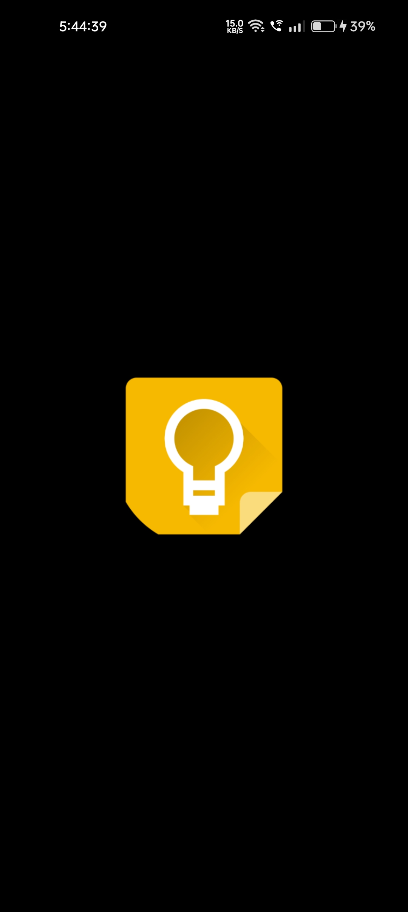
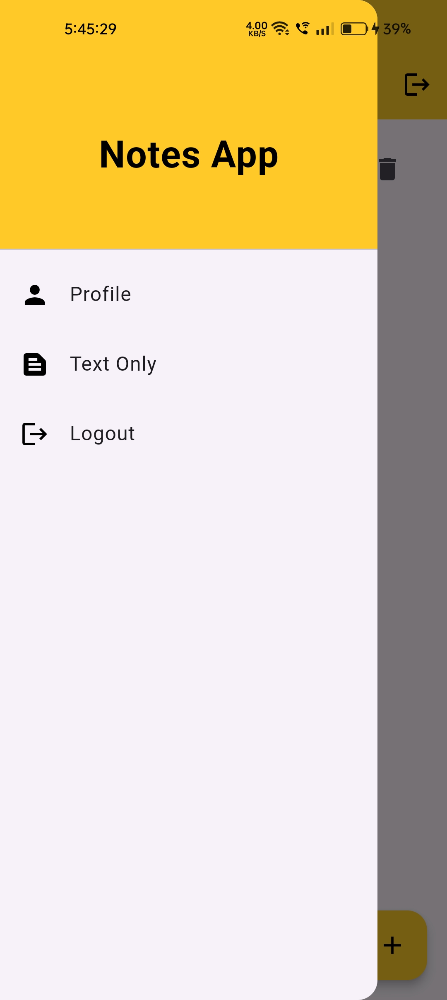
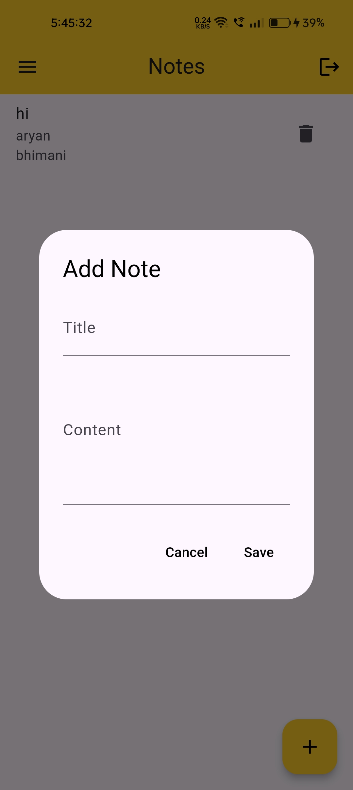
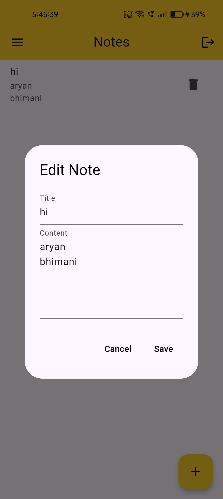

# Notes App

A simple **Notes App** built using **Flutter** and **Firebase**. The app allows users to take notes and sync them across devices in real-time using Firebase. It's designed to be simple, intuitive, and highly functional with cloud storage.

## Features
- **Real-time Syncing**: Keep your notes updated across all devices using Firebase.
- **User-friendly Interface**: Clean and intuitive design for easy note management.
- **Cloud Storage**: Store notes securely in the cloud and access them anytime, anywhere.
- **Cross-Platform**: Supports both Android and iOS devices.
- **Authentication**: Secure user authentication with Firebase Auth (optional).

## Getting Started

Follow these steps to get your development environment set up for the Notes App.

### Prerequisites

- Install **Flutter**: Follow the instructions on the [official Flutter website](https://flutter.dev/docs/get-started/install).
- Set up a **Firebase Project**:
    - Go to the [Firebase Console](https://console.firebase.google.com/).
    - Create a new Firebase project and configure it for both **Android** and **iOS**.
    - Download the configuration files (`google-services.json` for Android and `GoogleService-Info.plist` for iOS).

### Installation

1. Clone the repository:

   ```bash
   git clone https://github.com/your-username/notes-app.git









<a href="https://dev-aryanbhimani.pantheonsite.io/" target="_blank"></a>
<a href="https://www.linkedin.com/in/aryanbhimani/" target="_blank"></a>
<a href="https://github.com/AryanBhimani" target="_blank"></a>
<a href="https://twitter.com/yourtwitterhandle" target="_blank"></a>
